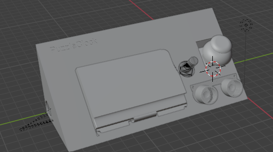

Total time: ~10 hours

# Day 1 (30/7) ~4 hours

Today I researched the best moduels to use. I settled on common inexpensive moduels that most people would have around to make this an easy project for others to build, with the exception of the large lcd screen. I decided to use lcd instead of oled as it is a lot cheaper for such a large screen. I decided to use an arduino uno as the microcontroller as it is the most common and most people would have one lying around. I refined the idea of the project and came up with some puzzles/games for the clock: maths question susing random numbers, a maze game, a snake clone and a game where you have to dodge a projected block. I have a joystick module lying around that I can incorporate into the design. I also decided to include an ultrasonic sensor to detect if the user tries to cheat and return to bed within a certain amount of time of disabling the alarm in which case the alarm is reenabled. Next, I created custom symbols for the components I would be using using the datasheets and wired everything up to create the schematic
  
I then created the case in fusion 360, after a few iterations going for this slanted design with cutouts for the components. I also engraved th ename of the project into the top left of the case. I will print the back of the case seperately to the rest of the case so its easy to access the inside of the clock once printed.

# Day 2 (31/7) ~6 hours

Today I wrote the arduino sketch for the project which was the most time consuming and difficult part. I need to wait for the lcd display to arrive to be able to test everything properly but I used some random arduino tutorials for different modules to create this sketch which i think should work. I also spent a while finding models of electronic components to put into the CAD of the case, importing everything into blender. I  wasn't able to get a render of the clock as my laptop isnt powerful enough but got this which shows roughly where each component will go.due to some weird scaling issues it looks like some of the components dont fit properly or clip through the model but they will fit properly in real life. Peformance issues on my laptop also made blender very difficult to work with.
