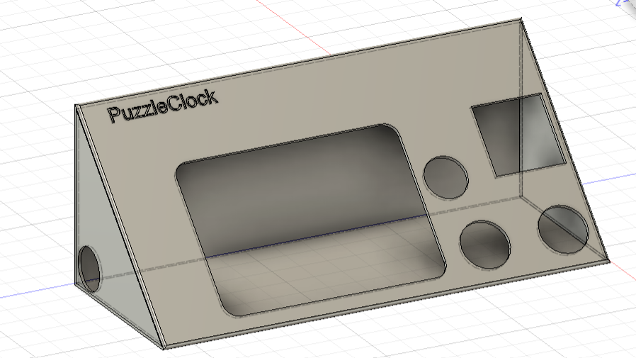
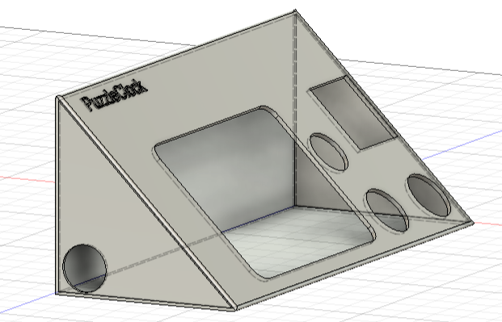
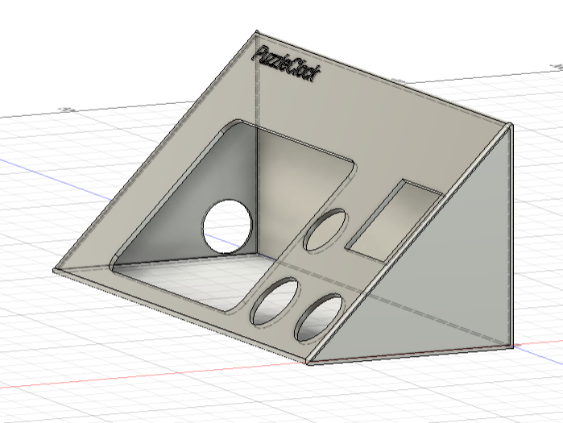
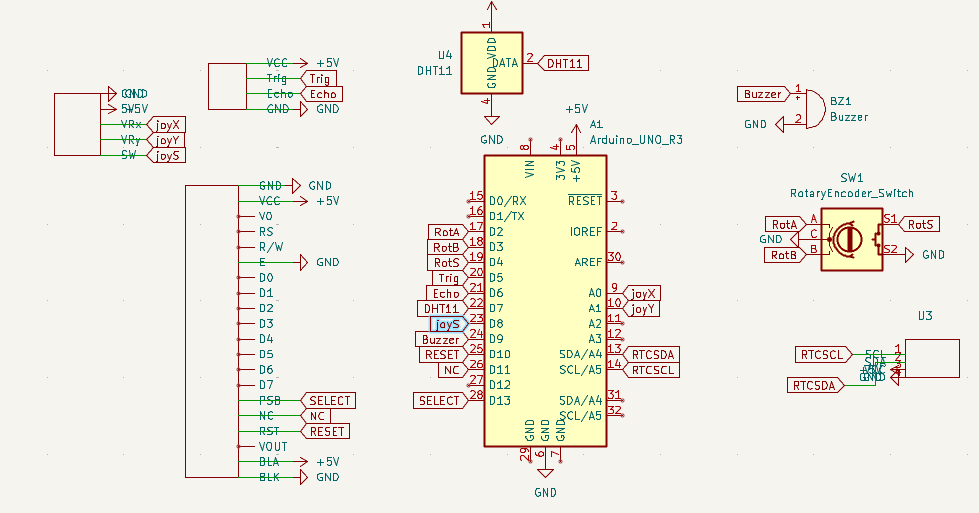
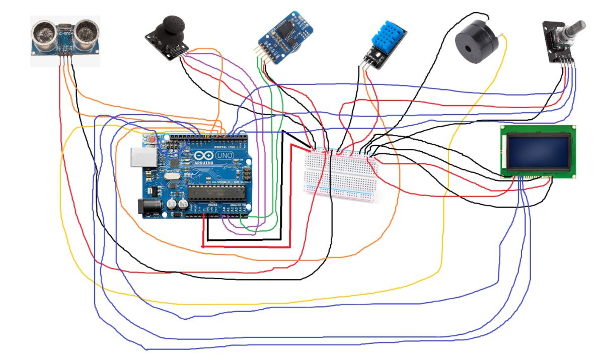
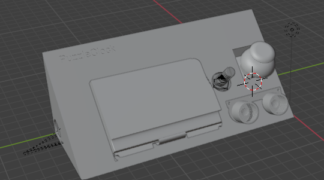

PuzzleClock is an alarm clock that makes you actually get out of bed. It makes you solve a random puzzle or game to disable the alarm and uses an ultrasonic sensor to detect if you try to return to bed instead of getting up. It is easy to build with an arduino uno and a few modules. It uses a rotary encoder, joystick, 128x64 lcd display, rtc module, ultrasonic sensor and passive buzzer. It can be powered through usb 2.0 or via a 9v battery.

| Component              | Link                                                                                                                                                                                                                                                | Price (USD) |
|------------------------|-----------------------------------------------------------------------------------------------------------------------------------------------------------------------------------------------------------------------------------------------------|-------------|
| LCD Display            | https://www.aliexpress.com/item/32815375122.html?src=google&src=google&albch=shopping&acnt=494-037-6276&isdl=y&slnk=&plac=&mtctp=&albbt=Google_7_shopping&aff_platform=google&aff_short_key=UneMJZVf&&albagn=888888&&ds_e_adid=&ds_e_matchtype=&ds_e_device=c&ds_e_network=x&ds_e_product_group_id=&ds_e_product_id=en32815375122&ds_e_product_merchant_id=107769163&ds_e_product_country=GB&ds_e_product_language=en&ds_e_product_channel=online&ds_e_product_store_id=&ds_url_v=2&albcp=17859500389&albag=&isSmbAutoCall=false&needSmbHouyi=false&gad_campaignid=17190468917 | 12.00       |
| Ultrasonic Sensor      | Already have                                                                                                                                                                                                                                        | 0.00        |
| Passive Buzzer         | Already have                                                                                                                                                                                                                                        | 0.00        |
| Rotary Encoder         | Already have                                                                                                                                                                                                                                        | 0.00        |
| RTC Module             | https://www.aliexpress.com/item/1005007143596890.html?spm=a2g0o.productlist.main.3.556d350aziCGEs&algo_pvid=07fe5c58-f743-44aa-a00e-c5f6bd54c5aa&pdp_ext_f=%7B%22order%22%3A%222569%22%2C%22eval%22%3A%221%22%7D&utparam-url=scene%3Asearch%7Cquery_from%3A                        | 1.47        |
| Joystick Module        | Already have                                                                                                                                                                                                                                        | 0.00        |
| Arduino Uno            | Already have                                                                                                                                                                                                                                        | 0.00        |
| CR2032 Battery (for RTC, cheaper from local store as no shipping and dont need bulk) | https://www.sainsburys.co.uk/gol-ui/product/duracell-twin-coin-cell-battery--2032-3v                                                                                                                                                              | 6.60        |
| Case (3D Printed)      | Printed with personal 3D printer                                                                                                                                                                                                                    | 0.00        |
Total: 20.07 usd